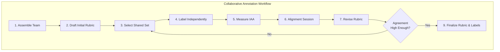
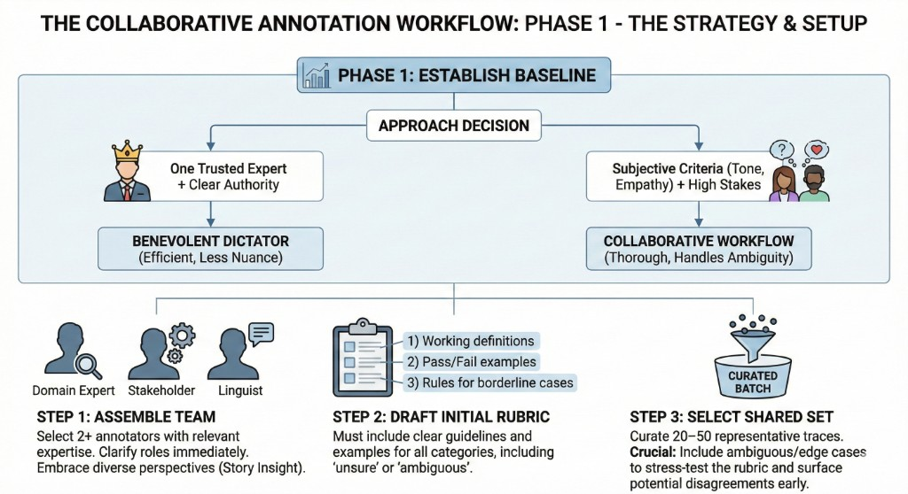
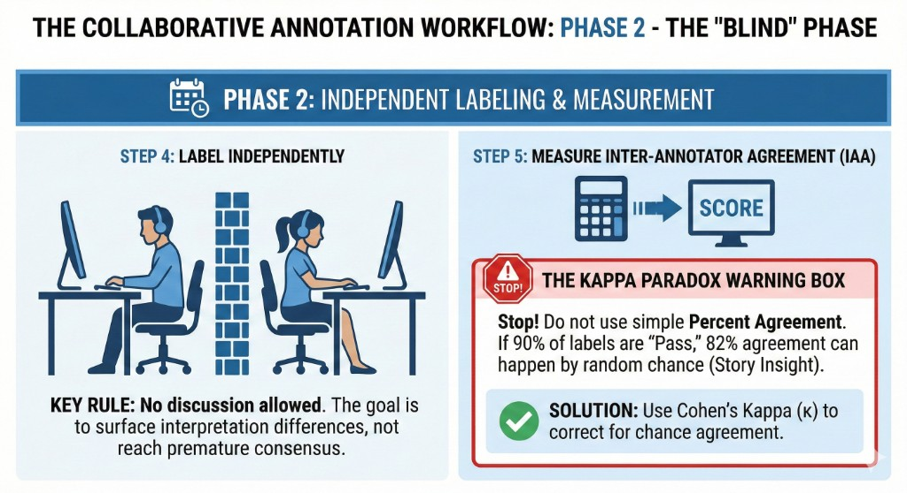
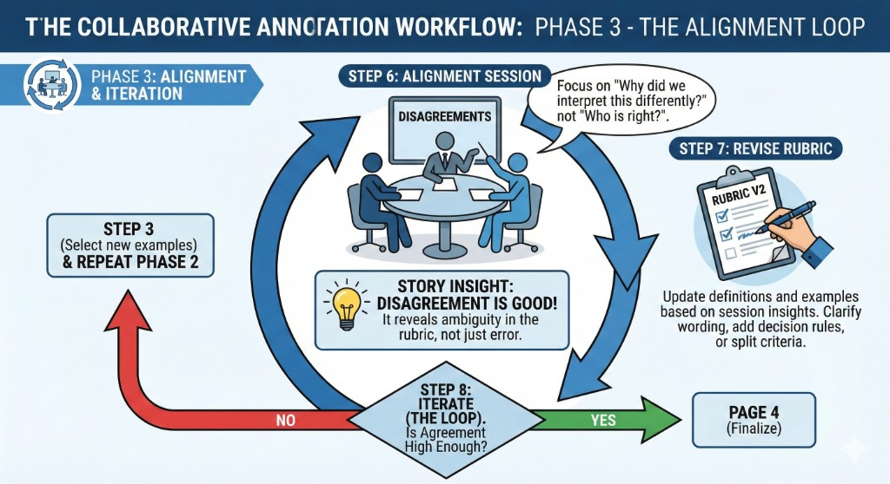
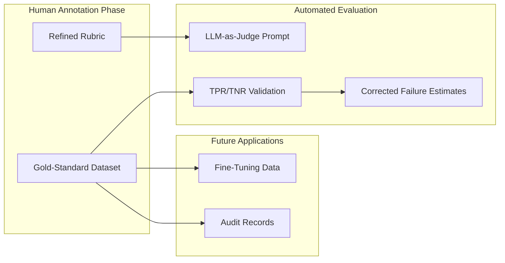
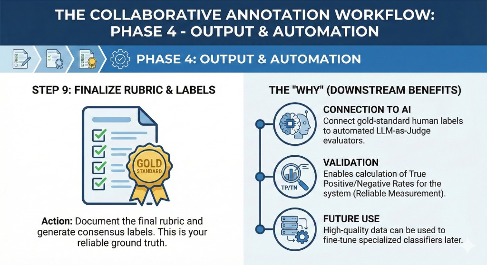

# Tutorial 04: Collaborative Evaluation Practices


## Learning Objectives

By the end of this tutorial, you will be able to:

- [ ] Determine when to use a "benevolent dictator" (single expert) vs. collaborative multi-annotator approach
- [ ] Apply the 9-step collaborative annotation workflow to develop consistent evaluation rubrics
- [ ] Calculate and interpret Cohen's Kappa to measure inter-annotator agreement beyond chance
- [ ] Select appropriate agreement metrics (Cohen's κ, Fleiss' κ, Krippendorff's α) based on your annotation setup
- [ ] Facilitate alignment sessions that refine rubrics rather than just resolve past disagreements
- [ ] Connect gold-standard human labels to automated LLM-as-Judge evaluators
- [ ] Recognize when genuine disagreement signals legitimate subjectivity rather than rubric flaws

---

## Tutorial Overview

This tutorial covers three interconnected areas:

1. **Evaluation Models** - Choosing between single-expert and collaborative approaches
2. **9-Step Workflow** - Systematic process for developing consistent evaluation rubrics
3. **Agreement Metrics** - Measuring and interpreting inter-annotator consistency

Each section includes a focused visual guide to help orient you within the material.

---

## Phase 1: Establish Baseline (WHAT)

This tutorial focuses on **collaborative evaluation practices**—systematic approaches for involving multiple human experts to define, refine, and apply evaluation criteria. The Analyze-Measure-Improve lifecycle introduced in Tutorial 01 depends critically on "correct" human judgment. But human judgment can be unreliable or inconsistent, especially for subjective qualities like helpfulness, tone, or creativity.

We continue with our running example:

> **Example: Real Estate CRM Assistant**
> 
> The assistant helps real estate agents with property searches, scheduling, email drafting, and market analysis. Evaluating whether responses have the "appropriate tone for client persona" is inherently subjective—what seems professional to one evaluator may feel cold to another.

### When Is Collaborative Evaluation Needed?


Not every evaluation task requires multiple annotators. Collaborative evaluation is most valuable when:

| Scenario | Why Collaboration Helps |
|----------|------------------------|
| **Subjective criteria** | "Helpfulness," "empathy," "brand voice" have no single correct interpretation |
| **Complex domains** | Legal, medical, financial contexts require diverse expertise |
| **Cross-functional stakeholders** | Product, engineering, compliance may have different quality definitions |
| **High-stakes decisions** | Regulatory or safety contexts benefit from multiple perspectives |
| **Scaling annotation** | Multiple annotators must apply criteria consistently |

### The "Benevolent Dictator" Alternative

Before investing in collaborative workflows, consider whether a **single principal domain expert** might be more effective. In smaller organizations, there's often one individual whose judgment is crucial for the AI product's success.

**Why a Benevolent Dictator Can Work:**

1. **They Set the Standard:** The expert defines what is acceptable technically and represents user expectations
2. **Capture Unspoken Expectations:** Through the evaluation process, they clarify what a "passable" AI interaction looks like
3. **Consistency in Judgment:** Focusing on one expert removes annotation conflicts
4. **Sense of Ownership:** The expert feels invested because they've shaped the criteria

**Examples of Principal Domain Experts:**
- A psychologist for a mental health AI assistant
- A lawyer for an AI that analyzes legal documents
- A customer service director for a support chatbot
- A lead teacher for an educational AI tool

> **When to Choose Dictator vs. Collaboration:**
> 
> The choice isn't about organization size per se—it's about whether authority can meaningfully be delegated to a single individual. Whenever possible, appointing a trusted expert as the decision-maker is an effective way to unblock the labeling bottleneck that many teams face.

### Key Terminology

| Term | Definition |
|------|------------|
| **Inter-Annotator Agreement (IAA)** | Quantitative measure of how consistently multiple annotators apply the same rubric |
| **Rubric** | A set of definitions, criteria, and examples that guide annotation decisions |
| **Gold-Standard Dataset** | A set of traces with consensus labels, used to validate automated evaluators |
| **Cohen's Kappa (κ)** | Agreement metric for two raters that corrects for chance agreement |
| **Alignment Session** | Structured meeting where annotators discuss disagreements to refine the rubric |
| **Percent Agreement (Po)** | Simple proportion of items where annotators assigned the same label |

### The 9-Step Collaborative Annotation Workflow


When collaborative evaluation is appropriate, follow this structured process:



**Step-by-Step Walkthrough:**



*Figure: Workflow Phase 1 establishes baseline decisions. Left branch (benevolent dictator) is efficient for clear authority; right branch (collaborative) handles subjective criteria. Steps 1-3 assemble the team, draft the initial rubric, and select a representative annotation set.*

**1. Assemble the Annotation Team**
Select two or more annotators with relevant domain expertise or stakeholder perspective. Clarify roles and scope from the outset.

**2. Draft an Initial Rubric**
Create a first version including:
- A working definition of the evaluation criterion (e.g., "Is the email tone appropriate for the client persona?")
- Illustrative Pass/Fail examples
- Any decision rules for borderline cases

**3. Select a Shared Annotation Set**
Curate 20–50 representative traces that all annotators will label. Include borderline or ambiguous cases to stress-test the rubric.

**4. Label Independently**
Each annotator labels all examples on their own. **No discussion is allowed during this phase.** The goal is to surface interpretation differences, not reach consensus yet.

**5. Measure Inter-Annotator Agreement (IAA)**
Compute agreement scores using metrics like Cohen's Kappa (Section 4.3). Low agreement flags rubric ambiguity.

**6. Facilitate Alignment Session(s)**
Bring annotators together to discuss disagreements. Focus on understanding *why* interpretations differed, not on changing past labels.

**7. Revise Rubric**
Update definitions, refine examples, and adjust labeling criteria based on alignment insights.

**8. Iterate**
Repeat steps 3-7 with new examples until agreement reaches acceptable levels.

**9. Finalize Rubric and Labels**
Document the final rubric and generate a consensus-labeled "gold-standard" dataset for validating automated evaluators.

---

### Deep Dive: Measuring Inter-Annotator Agreement




*Figure: Workflow Phase 2 enforces independent labeling (Step 4) with no discussion allowed. Step 5 measures IAA using Cohen's Kappa, not raw percent agreement. The Kappa Paradox warning box highlights why chance correction matters.*

#### The Problem with Percent Agreement

The simplest measure is **Percent Agreement (Po)**—the proportion of items where both annotators assigned the same label:

$$P_o = \frac{\text{Number of agreements}}{\text{Total items}}$$

While easy to compute, Po is misleading because it doesn't account for agreement that could happen by chance. This is especially problematic when one label dominates (e.g., mostly "Pass" as system quality improves).

**Example: The Misleading High Agreement**

Imagine two annotators label 100 traces, and 90% are "Pass":
- If both annotators randomly assigned labels following the same 90/10 distribution, they'd agree by chance ~82% of the time
- A Po of 85% might seem good, but it's barely above chance!

#### Cohen's Kappa: Correcting for Chance

**Cohen's Kappa (κ)** (Cohen 1960) is the standard measure for inter-annotator agreement on categorical data. It compares observed agreement to expected chance agreement:

$$\kappa = \frac{P_o - P_e}{1 - P_e}$$

Where:
- **Po** = Observed agreement (percent of items with same label)
- **Pe** = Expected agreement by chance

**Computing Pe:**

Pe uses marginal probabilities—the overall fraction each annotator assigns to each label:

$$P_e = \sum_k p_{1k} \cdot p_{2k}$$

Where p₁ₖ is the fraction of items annotator 1 assigned to category k, and p₂ₖ is the fraction annotator 2 assigned to category k.

**Interpreting Kappa Values:**

| κ Range | Interpretation (Landis & Koch 1977) |
|---------|-------------------------------------|
| < 0 | Poor (systematic disagreement) |
| 0.00–0.20 | Slight |
| 0.21–0.40 | Fair |
| 0.41–0.60 | Moderate |
| 0.61–0.80 | Substantial |
| 0.81–1.00 | Almost perfect |

**In practice, aim for κ ≥ 0.6 to ensure labeling reliability.**

**What Kappa Values Mean:**
- **κ = 1:** Perfect agreement—annotators always assign the same label
- **κ = 0:** Agreement equals chance—no better than random
- **κ < 0:** Systematic disagreement—annotators are anti-correlated

#### Worked Example: Computing Cohen's Kappa

Two annotators (Rater A, Rater B) evaluated 10 summaries for "informativeness" (Pass/Fail):

| Trace | Rater A | Rater B |
|-------|---------|---------|
| 1 | Pass | Pass |
| 2 | Fail | Fail |
| 3 | Pass | Fail |
| 4 | Pass | Pass |
| 5 | Fail | Fail |
| 6 | Pass | Pass |
| 7 | Fail | Pass |
| 8 | Pass | Pass |
| 9 | Pass | Fail |
| 10 | Pass | Pass |

**Step 1: Calculate Po (Observed Agreement)**

Agreements on traces: 1, 2, 4, 5, 6, 8, 10 = 7 traces

$$P_o = \frac{7}{10} = 0.70$$

**Step 2: Build Contingency Table**

|  | Rater B: Pass | Rater B: Fail | Total |
|--|---------------|---------------|-------|
| **Rater A: Pass** | 5 | 2 | 7 |
| **Rater A: Fail** | 1 | 2 | 3 |
| **Total** | 6 | 4 | 10 |

**Step 3: Calculate Marginal Proportions**

- Rater A: p(Pass) = 7/10 = 0.7, p(Fail) = 3/10 = 0.3
- Rater B: p(Pass) = 6/10 = 0.6, p(Fail) = 4/10 = 0.4

**Step 4: Calculate Pe (Expected Chance Agreement)**

$$P_e = (0.7 \times 0.6) + (0.3 \times 0.4) = 0.42 + 0.12 = 0.54$$

**Step 5: Calculate Kappa**

$$\kappa = \frac{0.70 - 0.54}{1 - 0.54} = \frac{0.16}{0.46} \approx 0.348$$

**Interpretation:** A κ of ~0.35 falls in the "Fair" range. This suggests the rubric for "informativeness" needs significant refinement—annotators aren't consistently applying it.

#### Python Implementation

```python
from collections import Counter

def cohens_kappa(rater1, rater2):
    assert len(rater1) == len(rater2), "Annotation lists must have same length."
    n_items = len(rater1)
    if n_items == 0:
        return 1.0  # Convention: 1 if nothing to disagree on
    
    # Observed agreement
    observed_agreement = sum(1 for i in range(n_items) if rater1[i] == rater2[i])
    po = observed_agreement / n_items
    
    # Expected agreement
    labels = set(rater1) | set(rater2)
    count1 = Counter(rater1)
    count2 = Counter(rater2)
    pe = sum(
        (count1.get(label, 0) / n_items) * (count2.get(label, 0) / n_items)
        for label in labels
    )
    
    # Handle edge case
    if pe == 1.0:
        return 1.0 if po == 1.0 else 0.0
    else:
        return (po - pe) / (1 - pe)

# Example usage
annotations1 = ['Pass', 'Fail', 'Pass', 'Pass', 'Fail', 'Pass', 'Fail', 'Pass', 'Pass', 'Pass']
annotations2 = ['Pass', 'Fail', 'Fail', 'Pass', 'Fail', 'Pass', 'Pass', 'Pass', 'Fail', 'Pass']
print(f"Cohen's Kappa: {cohens_kappa(annotations1, annotations2):.3f}")
# Output: Cohen's Kappa: 0.348
```

#### Beyond Cohen's Kappa: Other Agreement Metrics

| Metric | When to Use | Key Feature |
|--------|-------------|-------------|
| **Cohen's Kappa** | Exactly 2 raters, nominal categories | Standard pairwise measure |
| **Fleiss' Kappa** | 3+ raters, same items, fixed raters per item | Multi-rater extension |
| **Krippendorff's Alpha** | Variable raters per item, missing data, ordinal/interval data | Most flexible |
| **Weighted Kappa** | Ordinal scales where some disagreements are worse than others | Accounts for distance between ratings |

**Important Caveat:** Cohen's Kappa measures agreement between two peer annotators. It is **not** used to evaluate LLM-as-Judge outputs against human labels treated as ground truth. Once human ground truth is established, evaluate the LLM as a classifier using metrics like TPR, TNR, FPR, and FNR (covered in Tutorial 05).

---

## Phase 2: Challenge Assumptions (WHY)

### Assumption 1: "High IAA Is Always the Goal"

**The conventional belief:** We should maximize inter-annotator agreement; low agreement indicates a problem.

**The challenge:** Genuine disagreement can signal legitimate subjectivity, not just rubric flaws.

**Research Evidence (Plank 2022):** Barbara Plank's influential position paper argues that human label variation should not be treated as noise to be eliminated. For tasks like toxicity detection, word sense disambiguation, or subjective quality assessment, multiple plausible interpretations genuinely exist.

**When Disagreement Is Constructive:**

| Disagreement Type | Signal | Action |
|-------------------|--------|--------|
| **Rubric ambiguity** | Wording is vague | Clarify definitions |
| **Edge case gap** | Rubric doesn't cover scenario | Add decision rules |
| **Legitimate subjectivity** | Multiple valid interpretations exist | Consider retaining un-aggregated labels |
| **Expertise difference** | Annotators have different backgrounds | May need specialized sub-rubrics |

**Implication:** Before forcing consensus, ask: "Is this disagreement revealing a rubric flaw, or a genuine plurality of valid perspectives?"

### Assumption 2: "Single Expert Judgment Is Always Worse"

**The conventional belief:** Multiple perspectives are always better than one person's judgment.

**The challenge:** For many organizations, the benevolent dictator model is more efficient and equally valid.

**When Single-Expert Is Preferable:**

| Factor | Favors Dictator | Favors Collaboration |
|--------|-----------------|---------------------|
| **Organization size** | Small to medium | Large, cross-functional |
| **Expertise concentration** | Clear domain expert exists | Expertise is distributed |
| **Decision authority** | Authority is clear | Authority is shared |
| **Subjectivity level** | Low to moderate | High |
| **Speed requirements** | Fast iteration needed | Thoroughness over speed |

**Hidden truth:** Collaborative evaluation has coordination costs. If a trusted expert can define "good enough" for your use case, appointing them as decision-maker unblocks the labeling bottleneck.

### Assumption 3: "Percent Agreement Is Good Enough"

**The conventional belief:** If annotators agree 85% of the time, we have good agreement.

**The challenge:** Percent agreement ignores chance agreement, especially with imbalanced labels.

**Example: The Kappa Paradox**

Consider a system that's 95% reliable. Annotators label 100 traces:
- 95 traces are "Pass" (system worked correctly)
- 5 traces are "Fail" (system failed)

If both annotators follow this distribution independently, expected chance agreement:

$$P_e = (0.95 \times 0.95) + (0.05 \times 0.05) = 0.9025 + 0.0025 = 0.905$$

An observed agreement of 91% yields:

$$\kappa = \frac{0.91 - 0.905}{1 - 0.905} = \frac{0.005}{0.095} \approx 0.053$$

That's "Slight" agreement despite 91% raw agreement! When Pe is high, even high Po can produce low κ.

**Practical implication:** Always use chance-corrected metrics like Kappa, especially as your system improves and failure rates drop.

### Assumption 4: "IAA Is the Ceiling for ML Performance"

**The conventional belief:** Machine learning models can't exceed human inter-annotator agreement.

**The challenge:** Research shows ML models can actually exceed IAA when annotators are noisy.

**Evidence (ACL Anthology 2022):** A comprehensive simulation study found that well-specified ML models can exceed IAA, especially when:
- Annotators are inconsistent (noisy labeling)
- Annotators use different classification functions
- The underlying task has a cleaner signal than human judgment captures

**Implication:** Don't stop model development once performance reaches IAA. You may be under-utilizing your annotated data and overestimating system limitations.

### Assumption 5: "More Annotators = Better Quality"

**The conventional belief:** Having more people annotate produces more reliable results.

**The challenge:** Coordination costs increase, and groupthink risks emerge.

**Hidden Problems with Large Annotation Teams:**

| Problem | Impact |
|---------|--------|
| **Coordination overhead** | More meetings, longer alignment cycles |
| **Groupthink** | Dominant voices can bias less confident annotators |
| **Diluted expertise** | Not all annotators may have equal domain knowledge |
| **Slower iteration** | Harder to schedule, reach consensus, update rubrics |

**Practical recommendation:** 2-3 annotators is often sufficient for rubric development. Scale up only when annotation volume demands it, and ensure independent labeling before any discussion.

---

## Phase 3: Drill to Axioms (RECURSIVE WHYS)

### Axiom Chain 1: Natural Language Is Inherently Ambiguous

**Statement:** Perfect specification of evaluation criteria is impossible because natural language cannot fully capture intent.

**Recursive Why Chain:**

```
Why measure inter-annotator agreement?
├── To detect whether annotators interpret the rubric consistently
│   └── Why might interpretations differ?
│       ├── Because rubric definitions contain ambiguous language
│       │   └── Why is language ambiguous?
│       │       └── AXIOM: Natural language is inherently ambiguous;
│       │                  words carry multiple meanings, connotations,
│       │                  and contextual dependencies that cannot be
│       │                  fully eliminated through definition
```

**Stopping Criterion Met:**
- **Domain Independence:** This applies universally—legal contracts, medical protocols, and software specifications all face the same challenge
- **Linguistic Theory:** Confirmed by formal semantics and pragmatics research

**Practical Implication:** Rubric refinement is not a one-time task but an ongoing process. Expect multiple iterations, and treat ambiguity discovery as valuable signal, not failure.

### Axiom Chain 2: Finite Categories Produce Random Agreement

**Statement:** In any finite categorical labeling scheme, random assignment will produce non-zero agreement by chance.

**Recursive Why Chain:**

```
Why correct for chance agreement in Kappa?
├── Because raw percent agreement is inflated by random coincidence
│   └── Why does random coincidence happen?
│       ├── Because with finite labels, random selections will sometimes match
│       │   └── Why do random selections match?
│       │       └── AXIOM: In finite categorical spaces, random selection
│       │                  produces non-zero agreement (pigeonhole principle).
│       │                  With k categories, random agreement ≈ 1/k minimum.
```

**Stopping Criterion Met:**
- **Logical Law:** The pigeonhole principle is a mathematical certainty
- **Probability Theory:** Expected agreement under random assignment is calculable

**Practical Implication:** Never interpret percent agreement in isolation. The more imbalanced your label distribution, the more misleading raw agreement becomes.

### Axiom Chain 3: Requirements Emerge Through Application

**Statement:** You cannot fully specify evaluation criteria before encountering concrete examples.

**Recursive Why Chain:**

```
Why iterate on rubrics instead of getting them right the first time?
├── Because initial definitions miss edge cases
│   └── Why are edge cases unknown initially?
│       ├── Because you can't anticipate all inputs your system will encounter
│       │   └── Why can't you anticipate all inputs?
│       │       └── AXIOM: Requirements emerge through application
│       │                  (Simon's bounded rationality). Humans cannot
│       │                  enumerate all cases without first encountering them.
```

**Stopping Criterion Met:**
- **Physical Law:** Information theory—you cannot process information you haven't received
- **Cognitive Science:** Herbert Simon's bounded rationality research

**Practical Implication:** Plan for 2-3 rubric revision cycles. The first version is a hypothesis, not a final answer.

### Axiom Chain 4: Human Judgment Is Conditioned on Individual Experience

**Statement:** Individual annotators bring different priors, experiences, and perspectives that affect interpretation.

**Recursive Why Chain:**

```
Why involve multiple annotators for subjective criteria?
├── Because single individuals have biased perspectives
│   └── Why are individual perspectives biased?
│       ├── Because judgment is shaped by personal experience
│       │   └── Why does experience shape judgment?
│       │       └── AXIOM: Human judgment is conditioned on individual
│       │                  experience. No single perspective is universally
│       │                  representative for subjective qualities.
```

**Stopping Criterion Met:**
- **Domain Independence:** Applies to all human cognition, not just annotation
- **Cognitive Science:** Well-established in judgment and decision-making research

**Practical Implication:** For highly subjective criteria (helpfulness, empathy, creativity), multiple perspectives are not just nice-to-have—they're epistemologically necessary.

---

## Phase 4: Understand Mechanisms (HOW)

### How Cohen's Kappa Works: The Deep Mechanism

**Why Marginal Probabilities for Pe?**

The key insight is that Pe models "random but informed" agreement. We don't assume annotators flip fair coins—we assume they follow their own labeling tendencies.

```
Annotator 1: Labels 70% Pass, 30% Fail (their tendency)
Annotator 2: Labels 60% Pass, 40% Fail (their tendency)

Random agreement on Pass: 0.70 × 0.60 = 0.42
Random agreement on Fail: 0.30 × 0.40 = 0.12
Total expected by chance: 0.54
```

This captures: "If each annotator labeled randomly according to their overall tendencies, how often would they coincidentally agree?"

**The Denominator (1 - Pe):**

The denominator represents the "room for improvement" above chance. If Pe = 0.5, there's 50% room for real agreement. If Pe = 0.9, there's only 10% room—making high Kappa much harder to achieve.

**Visual Interpretation:**

```
Po = 0.0          Pe            1.0
|-----------------|-------------|
     Worse than    Chance        Perfect
     chance                      agreement

κ measures where you fall in the "above chance" range:
κ = (Po - Pe) / (1 - Pe)
```

### How Alignment Sessions Work

**Preparation Phase:**

1. **Calculate IAA scores** and share with the group
2. **Identify specific traces** where disagreements occurred
3. **Appoint a neutral moderator** to keep discussion on track
4. **Timebox** each disagreement discussion (e.g., 5 minutes max)

**Session Goal:**

The goal is **not** to force agreement on past labels, but to understand why annotators interpreted things differently and improve the rubric for future consistency.

**Key Question:** "What changes would make future annotators agree on this case?"



*Figure: Workflow Phase 3 implements the alignment loop. Step 6 facilitates discussion focusing on "why did we interpret differently?" rather than "who is right?" Step 7 revises the rubric. Step 8 checks if agreement is high enough (usually kappa >= 0.6); if not, loop back with new examples.*

**Alignment Session Techniques:**

| Technique | When to Use | Example |
|-----------|-------------|---------|
| **Clarify Wording** | Vague or overloaded terms | "Professional" → "No slang, no emojis, formal salutation" |
| **Add Examples** | Borderline cases | Include Pass/Fail examples for edge cases |
| **Add Decision Rules** | Recurring ambiguity | "If response lacks price, label as Fail" |
| **Split Criteria** | Rubric covers multiple ideas | Separate "tone" from "completeness" |
| **Avoid Majority Vote** | For rubric design | Voting resolves labels, not rubric quality |
| **Escalation Path** | Persistent disagreement | Senior reviewer makes final call |

**Document Everything:**

Record all rubric updates and reasoning. This maintains clarity over time and supports consistent application as the project evolves.

### How Collaborative Labels Connect to Automated Evaluators

The outputs of collaborative annotation—refined rubric and gold-standard labels—are critical for building reliable automated evaluators.





*Figure: Workflow Phase 4 finalizes the rubric and gold-standard labels (Step 9). The "Gold Standard" badge indicates these consensus labels serve three purposes: (1) connecting to automated LLM-as-Judge evaluators, (2) enabling TPR/TNR validation, and (3) providing future fine-tuning data.*

**Three Benefits:**

1. **Clearer Rubric → Better LLM Judge:** With explicit, well-tested instructions from alignment sessions, the LLM-as-Judge is more likely to follow intended criteria reliably.

2. **Gold-Standard Dataset → Validation:** Consensus labels provide trusted ground truth for calculating TPR/TNR (Tutorial 05). Knowing human labels were consistent makes corrected failure rate estimates reliable.

3. **Future Training Data:** Gold-standard traces can later be used for fine-tuning specialized classifiers. Save all well-annotated data—it has value beyond immediate evaluation.

### How to Choose Between Dictator and Collaboration

**Decision Framework:**

```
┌─────────────────────────────────────────────────────────────────────┐
│                    CHOOSING YOUR APPROACH                            │
├─────────────────────────────────────────────────────────────────────┤
│                                                                      │
│  Is there ONE person whose judgment is crucial and trusted?         │
│       │                                                              │
│       ├── YES ──► Can they define "good enough" for your use case?  │
│       │               │                                              │
│       │               ├── YES ──► BENEVOLENT DICTATOR                │
│       │               │           (faster, simpler, consistent)      │
│       │               │                                              │
│       │               └── NO ───► COLLABORATIVE                      │
│       │                           (need multiple perspectives)       │
│       │                                                              │
│       └── NO ──► Is the criterion highly subjective?                 │
│                       │                                              │
│                       ├── YES ──► COLLABORATIVE                      │
│                       │           (multiple perspectives essential)  │
│                       │                                              │
│                       └── NO ───► Single annotator may suffice       │
│                                   (but use IAA to validate later)    │
│                                                                      │
└─────────────────────────────────────────────────────────────────────┘
```

---

## Phase 5: Contextualize & Apply (WHEN/WHERE)

### When to Use Each Approach

**Benevolent Dictator Model:**

| Scenario | Example |
|----------|---------|
| Small startup with clear domain founder | CEO defines "good" for legal AI |
| Tight deadlines requiring fast iteration | MVP needs quick feedback loops |
| Clear expertise concentration | Lone data scientist on team |
| Low subjectivity criteria | Format validation, completeness |

**Collaborative Model:**

| Scenario | Example |
|----------|---------|
| Cross-functional stakeholders | Product, legal, engineering all care |
| Regulatory/compliance context | Healthcare, finance need audit trails |
| Highly subjective criteria | "Empathetic," "creative," "helpful" |
| Scaling annotation to multiple labelers | Need consistent application |

### When Agreement Metrics Break Down

| Condition | Problem | Mitigation |
|-----------|---------|------------|
| **Highly imbalanced labels** | Kappa paradox: high Po, low κ even with good agreement | Use prevalence-adjusted metrics or interpret κ with context |
| **Ordinal scales** | Nominal Kappa treats "1 vs. 2" same as "1 vs. 5" | Use weighted Kappa or Krippendorff's Alpha |
| **Variable raters per item** | Fleiss' assumes fixed number of raters | Use Krippendorff's Alpha |
| **Genuine task ambiguity** | High agreement may mask valid disagreement | Consider retaining un-aggregated labels (Plank 2022) |
| **Missing data** | Some items not labeled by all raters | Use Krippendorff's Alpha |

### Boundary Conditions: When Collaborative Evaluation Breaks Down

| Condition | Why It Breaks | Mitigation |
|-----------|---------------|------------|
| **No clear quality definition** | Can't write rubric if you don't know what "good" looks like | Start with benevolent dictator to bootstrap |
| **Constantly shifting requirements** | Rubric becomes stale before finalization | Shorter iteration cycles, accept lower κ threshold |
| **Annotator availability** | Can't schedule alignment sessions | Asynchronous rubric refinement via documented comments |
| **Annotator fatigue** | Quality degrades over long annotation sessions | Limit sessions to 1-2 hours, rotate annotators |

### Transfer to Different Domains

The collaborative annotation workflow applies across domains with minor adaptations:

**Healthcare (Medical AI):**
- Expert annotators: Licensed physicians, nurses
- Criteria examples: Diagnosis accuracy, treatment appropriateness, safety
- Special concern: Regulatory documentation, audit trails

**Legal (Contract Analysis):**
- Expert annotators: Practicing attorneys, paralegals
- Criteria examples: Clause identification, risk assessment, compliance
- Special concern: Precedent consistency, jurisdiction variations

**Creative (Marketing Content):**
- Expert annotators: Copywriters, brand managers, target users
- Criteria examples: Tone, brand voice, engagement potential
- Special concern: Subjectivity is the point—may retain diverse labels

**Customer Support (Chatbots):**
- Expert annotators: Support leads, QA team, customer representatives
- Criteria examples: Empathy, resolution effectiveness, escalation appropriateness
- Special concern: Customer satisfaction alignment

---

## First Principles Map

### AXIOM 1: Natural Language Is Inherently Ambiguous

- **Statement:** Perfect specification of evaluation criteria through language is impossible
- **Stopping criterion met:** Domain Independence (applies universally across linguistics, law, medicine)
- **Confidence level:** High
- **Supporting evidence:** Formal semantics, pragmatics research, legal interpretation theory
- **Practical implication:** Rubric refinement is inherently iterative; plan for multiple revision cycles

### AXIOM 2: Finite Categories Produce Random Agreement

- **Statement:** In finite categorical labeling schemes, random assignment produces non-zero agreement by chance
- **Stopping criterion met:** Logical Law (pigeonhole principle, probability theory)
- **Confidence level:** High
- **Supporting evidence:** Mathematical proof; Pe is calculable from first principles
- **Practical implication:** Always use chance-corrected metrics (Kappa); percent agreement alone is misleading

### AXIOM 3: Requirements Emerge Through Application

- **Statement:** Evaluation criteria cannot be fully specified before encountering concrete examples
- **Stopping criterion met:** Physical Law (information theory, bounded rationality)
- **Confidence level:** High
- **Supporting evidence:** Herbert Simon's work on bounded rationality; software requirements engineering literature
- **Practical implication:** First rubric draft is a hypothesis; expect 2-3 revision cycles minimum

### AXIOM 4: Human Judgment Is Conditioned on Individual Experience

- **Statement:** Individual annotators bring different priors and perspectives that affect interpretation of subjective criteria
- **Stopping criterion met:** Domain Independence (cognitive science, judgment research)
- **Confidence level:** High
- **Supporting evidence:** Kahneman & Tversky on judgment biases; cross-cultural psychology
- **Practical implication:** Multiple perspectives are epistemologically necessary for subjective qualities

---

## Uncertainty Register

### What Remains Unknown

1. **Optimal annotator team size:** No theoretical framework determines ideal number. Empirical heuristics suggest 2-5 for rubric development, scaling up for volume.

2. **When to stop iterating:** The κ ≥ 0.6 threshold is convention (Landis & Koch 1977), not theoretically derived. Domain-specific thresholds may be more appropriate.

3. **Disagreement taxonomy completeness:** Zhang et al. (2024) taxonomy (task underspecification, style differences, refusals, errors) is recent and may evolve as research continues.

4. **LLM-human alignment limits:** Calibration techniques (GRACE, selective evaluation) are improving rapidly. Current best practices may be superseded.

5. **When to retain un-aggregated labels:** Plank's (2022) recommendation to preserve human label variation is gaining traction, but practical implementation patterns are still emerging.

### Areas for Further Investigation

- Automated detection of rubric ambiguity before annotation begins
- Optimal alignment session structures for remote/async teams
- Domain-specific κ thresholds validated against downstream task performance
- Integration of LLM-assisted annotation with human quality control

---

## Key Takeaways

1. **Collaborative evaluation produces shared, consistent criteria** for subjective tasks where single perspectives are insufficient.

2. **Benevolent dictators are often preferable** for small teams with clear domain experts—don't over-engineer when simple works.

3. **Cohen's Kappa corrects for chance agreement**—percent agreement alone is misleading, especially with imbalanced labels.

4. **Use Fleiss' Kappa for 3+ raters; Krippendorff's Alpha for flexibility** with missing data or ordinal scales.

5. **Alignment sessions refine rubrics, not just resolve past disagreements**—focus on "What would make future annotators agree?"

6. **Independent annotation before discussion prevents groupthink bias**—never skip this step even under time pressure.

7. **Gold-standard datasets enable TPR/TNR validation** of automated evaluators, making corrected failure estimates reliable.

8. **IAA is not a ceiling for ML performance**—research shows models can exceed noisy human agreement; don't stop improving prematurely.

9. **Genuine disagreement can signal legitimate subjectivity**, not just rubric flaws—consider retaining un-aggregated labels for inherently subjective tasks.

10. **Start with clear rubrics** to avoid frustrating and inefficient first-round annotation—invest time upfront in definitions and examples.

---

## Exercises

### Exercise 1: Calculate Cohen's Kappa (Mathematical)

Two annotators evaluated 8 customer support responses for "appropriate empathy level" (Pass/Fail). Their ratings are below:

| Response | Annotator A | Annotator B |
|----------|-------------|-------------|
| 1 | Pass | Pass |
| 2 | Pass | Fail |
| 3 | Fail | Fail |
| 4 | Pass | Pass |
| 5 | Pass | Pass |
| 6 | Fail | Pass |
| 7 | Pass | Pass |
| 8 | Fail | Fail |

**(a)** Calculate the observed percent agreement (Po).

**(b)** Build the contingency table and calculate expected chance agreement (Pe).

**(c)** Calculate Cohen's Kappa (κ).

**(d)** Interpret the result using Landis & Koch benchmarks. What does this suggest about the rubric?

<details>
<summary>Solution</summary>

**(a) Observed Percent Agreement (Po):**

Agreements on responses: 1, 3, 4, 5, 7, 8 = 6 responses

$$P_o = \frac{6}{8} = 0.75$$

**(b) Contingency Table and Pe:**

|  | B: Pass | B: Fail | Total |
|--|---------|---------|-------|
| **A: Pass** | 4 | 1 | 5 |
| **A: Fail** | 1 | 2 | 3 |
| **Total** | 5 | 3 | 8 |

Marginal proportions:
- Annotator A: p(Pass) = 5/8 = 0.625, p(Fail) = 3/8 = 0.375
- Annotator B: p(Pass) = 5/8 = 0.625, p(Fail) = 3/8 = 0.375

$$P_e = (0.625 \times 0.625) + (0.375 \times 0.375) = 0.391 + 0.141 = 0.532$$

**(c) Cohen's Kappa:**

$$\kappa = \frac{0.75 - 0.532}{1 - 0.532} = \frac{0.218}{0.468} \approx 0.466$$

**(d) Interpretation:**

A κ of ~0.47 falls in the "Moderate" agreement range (0.41–0.60). This is borderline acceptable but suggests the rubric for "appropriate empathy" needs refinement. An alignment session should explore the two disagreement cases (responses 2 and 6) to understand what caused different interpretations.

</details>

### Exercise 2: Alignment Session Scenario (Short Answer)

During an alignment session for a "helpfulness" rubric, annotators consistently disagree on traces where the LLM provides factually correct information but in a very technical way that a novice user might not understand.

Describe **two distinct techniques** from the alignment session methods that the moderator could use to resolve this disagreement and improve the rubric.

<details>
<summary>Solution</summary>

**Two distinct techniques:**

**(a) Clarify Language / Add Decision Rules:**

The moderator could lead a discussion to clarify what "helpfulness" means in this context. A decision rule could be added: "A response is 'Helpful: Pass' only if the language complexity is appropriate for the assumed user expertise level. If the user query suggests novice knowledge (e.g., basic questions, non-technical phrasing), the response must avoid unexplained jargon."

**(b) Add Concrete Examples:**

The moderator could add specific Pass/Fail examples to the rubric that address this exact scenario:
- **Example of Pass:** A technically accurate response that explains complex terms in parentheses or uses analogies
- **Example of Fail:** A technically accurate response that uses unexplained jargon when the user query indicates novice understanding

These concrete examples would provide clearer guidance for future annotations of similar cases.

</details>

### Exercise 3: Metric Selection (Multiple Choice / Short Answer)

Your team has **three annotators** (Alice, Bob, and Carol) independently labeling LLM outputs for "adherence to brand voice" using a predefined rubric with three categories: "Fully Adherent," "Partially Adherent," and "Not Adherent."

**(a)** Which IAA metric would be more appropriate here than Cohen's Kappa, and why is Cohen's Kappa not the best fit?

**(b)** If Carol was unavailable for 20% of the items (missing data), which metric would you choose instead?

<details>
<summary>Solution</summary>

**(a) Fleiss' Kappa is more appropriate here.**

Cohen's Kappa is specifically designed to measure agreement between **two raters**. Since there are three annotators (Alice, Bob, and Carol), Cohen's Kappa cannot be directly applied to assess overall agreement among all three simultaneously. While pairwise Kappas could be calculated (Alice-Bob, Alice-Carol, Bob-Carol), this doesn't give a single measure of overall team agreement.

Fleiss' Kappa is a generalization of Kappa that can assess agreement among **three or more raters** when they are all rating the same items using the same categorical scale.

**(b) Krippendorff's Alpha would be the best choice with missing data.**

Fleiss' Kappa assumes all items are rated by the same fixed number of raters. If Carol was unavailable for 20% of items, this assumption is violated. Krippendorff's Alpha is designed to handle:
- Variable numbers of raters per item
- Missing data
- Multiple raters

Additionally, since the categories are ordinal ("Fully" > "Partially" > "Not"), Krippendorff's Alpha can account for the distance between ratings, treating "Fully vs. Not Adherent" disagreement as more severe than "Fully vs. Partially Adherent."

</details>

---

## Next Steps

You now understand how to systematically involve multiple experts in defining evaluation criteria and measuring their consistency. The next tutorial covers what happens when you need to scale evaluation beyond human capacity.

